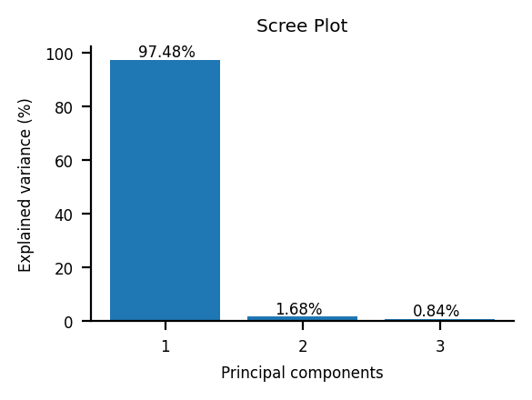

# PCA Visualization (Toy Example)


```python
from matplotlib import pyplot
import numpy
import pandas
from sklearn import datasets
from sklearn import preprocessing
from sklearn import decomposition
import plotter
```

Inspired on this video: https://www.youtube.com/watch?v=FgakZw6K1QQ

## Generation of 2 clusters on 3D


```python
data, clusters = datasets.make_blobs(n_samples=100, n_features=3, centers=2)
```


```python
plotter.plot_3d(data)
```


    

    


## PCA Analysis


```python
scaler = preprocessing.StandardScaler()
scaled_data = scaler.fit_transform(data)
```


```python
pca = decomposition.PCA(n_components=3)
```

The number of components to include in the PCA analysis depend of the "explained variance". If three components are enough to explain most of the variance then we should use that value. The library accepts values between 0 and the minimum value of the features/samples pair. In our case 3.


```python
principal_components=pca.fit_transform(scaled_data)
```


```python
plotter.scree_plot(pca)
```


    

    


The first two principal components explain most of the variance, therefore a 2D graph can be shown


```python
plotter.plot_first_two_principal_components(principal_components)
```


    

    


## Generation of 2 clusters on 5D


```python
data, clusters = datasets.make_blobs(n_samples=100, n_features=5, centers=2)
```

Five dimensions can't be visualized, to have an idea of how the data looks like we need to perform a PCA analysis

## PCA Analysis


```python
scaler = preprocessing.StandardScaler()
scaled_data = scaler.fit_transform(data)
pca = decomposition.PCA(n_components=4)
principal_components=pca.fit_transform(scaled_data)
plotter.scree_plot(pca)
```


    

    


We can plot the data in two dimensions with more than 95% of confidence that the variance between data will be represented


```python
plotter.plot_first_two_principal_components(principal_components)
```


    

    


```python

```
